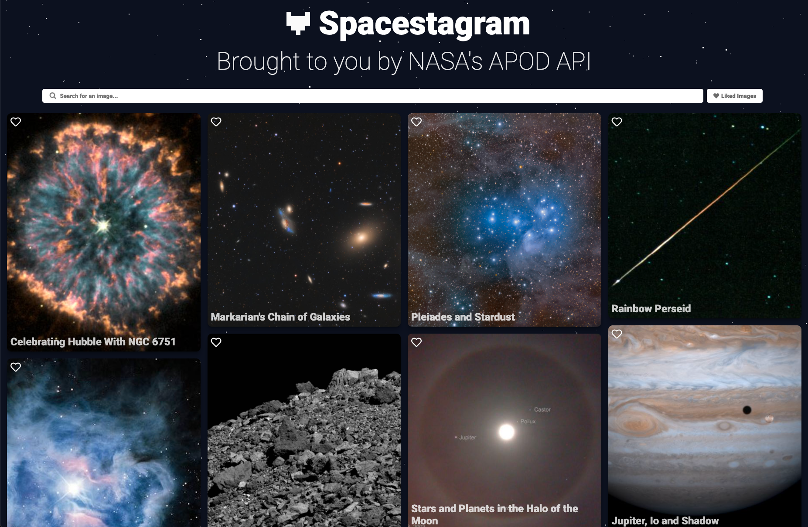
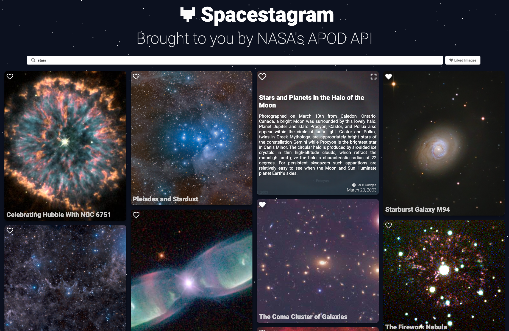
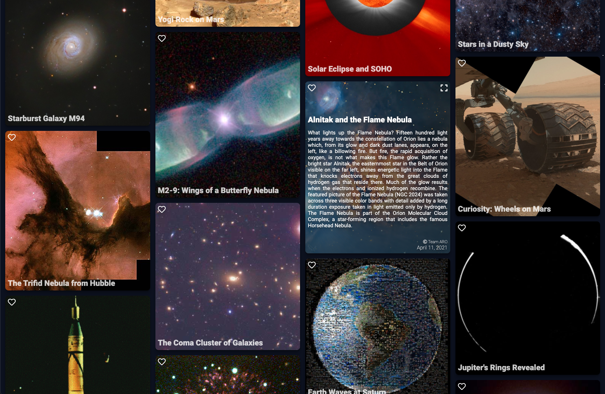
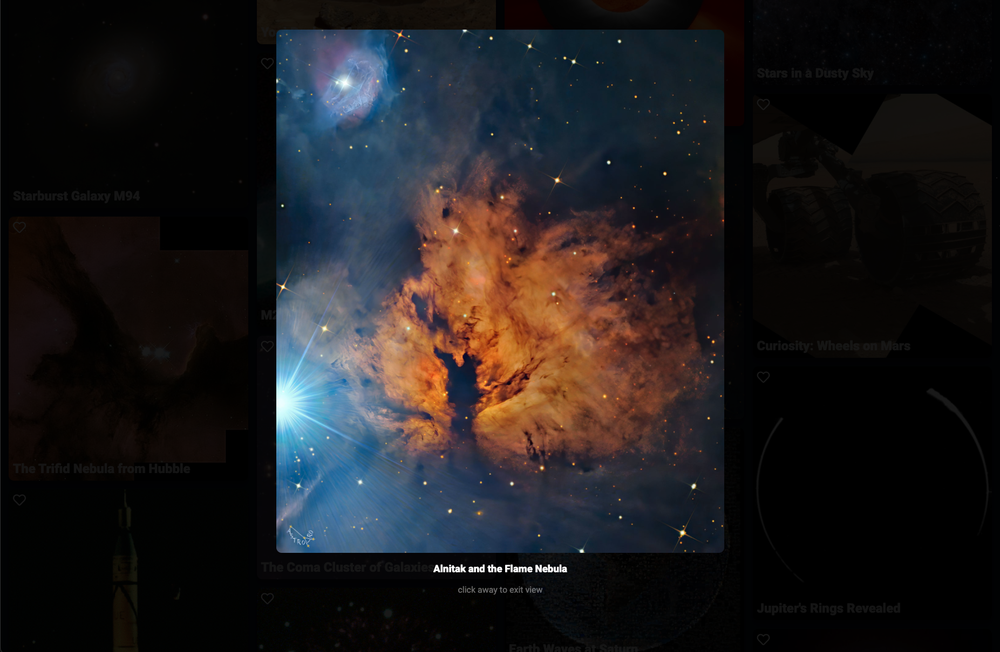

# Spacestagram

A static image repository fetched from NASA's [APOD Api](https://github.com/nasa/apod-api). I had a lot of fun working on this project and I learnt a lot.

## Key Features

- Fully Responsive
- Adaptively Tiled Image Cards
- Ability to like images
- Ability to search through images and filter by likes
- Clean animations

## Structure

### Overview

```
.
├── src       # front-end
├── examples  # example screenshots
├── extras    # extra scripts
└── docs      # built app for github pages
```

#### Source

Front-end written in javascript using svelte. I chose svelte because I love working with it and because I wanted to keep the site small and simple. The images fetched from the APOD api are cached in the clients local storage as well as what images they have liked. This was done to prevent unnecessary api calls and to persist state after a reload or when closed.

At the time of creating this project the APOD api was not returning `concept_tags` in their response so the image search functionality only checks the title, description, and date of the images.

To protect my api key I use a [Cloudflare Worker](https://workers.cloudflare.com/) to proxy my site's api requests to the APOD API. (src located in ./extras)

The site's design was inspired by [Unsplash](https://unsplash.com/).

## Screenshots

Additionally you can just view the site [HERE](https://nathanielfernandes.ca/spacestagram/)





## Setup

1. `git clone the repo`
2. `npm i`
3. `npm run dev` or `npm run build`
